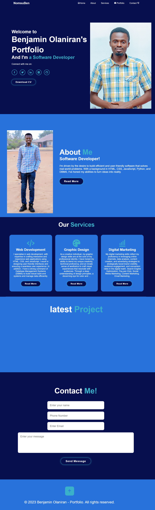

# Portfolio Website Project

## Project Overview:

This portfolio website project is designed to showcase my skills, work, and achievements as a web developer. Its primary purpose is to provide a platform for me to display my projects, skills, and experiences to potential employers, clients, and collaborators. 

**Goals:**
- Present my professional background and qualifications.
- Showcase my portfolio of web development projects.
- Highlight my technical skills and expertise.
- Provide a means for visitors to contact me for potential collaborations or job opportunities.

## Features and Functionality:

### 1. About Me Section
   - Displays a brief introduction about myself, including my background, skills, and interests.
   
### 2. Portfolio Section
   - Showcases a collection of my web development projects.
   - Allows users to click on project thumbnails to view project details, including descriptions, technologies used, and links to the project's live demo or source code.

### 3. Contact Section
   - Provides a contact form for users to send me messages or inquiries.
   - Lists links to my professional social media profiles and email address for direct contact.

### 4. Responsive Design
   - Ensures that the website is fully responsive, adapting to different screen sizes and devices for an optimal user experience.

## Technologies Used:

- HTML5
- CSS3
- JavaScript
- Git (for version control)
- GitHub Pages (for hosting)

## Screenshots or Demo:

You can access the live demo of this portfolio website by clicking [here](#). 

*Screenshot:*

## Roadmap and Future Enhancements:

In the future, I plan to enhance this portfolio website with the following features:

- Blog Section: Adding a blog to share my insights, experiences, and knowledge in web development.
- Project Filtering: Implementing filters to categorize and search projects easily.
- Performance Optimization: Improving website load times and optimizing resource usage.
- Additional Projects: Continuously adding new web development projects to the portfolio.
- Multilingual Support: Offering the website in multiple languages for a broader audience.

## Contact Information:

- **Name:** [Benjamin Olaniran]
- **Email:** [olaniranbenjamin@gmail.com]
- **LinkedIn:** [https://www.linkedin.com/in/benmilekan]
- **GitHub:** [https://github.com/NomsuBen]
- **Twitter:** [https://twitter.com/benmilekan]

Feel free to contact me through any of the provided channels for inquiries, collaborations, or any questions related to this portfolio website project.

## acknowledgement

Thank you ALX, Coach Cole and Obed for being an amazing and helpful Technical Mentor, every live session worth it.